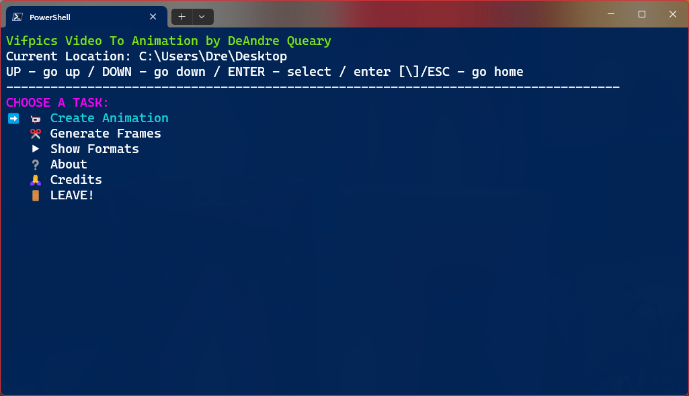

# Vifpics Video To Animation (light version)

# About
Vifpics is a menu driven PowerShell program for turning video clips into high quality animated images. It uses tools such as [ffmpeg](https://ffmpeg.org/), [gifski](https://gif.ski/) and others. Vifpics can turn videos into animated GIFs, PNGs (APNG), WebP, and AVIF. It can also be used to generate image stills from video.

# Navigate
* [Features](#features)
* [Requirements](#requirements)
* [Installation](#installation)
* [Creating Animations/Video](#creating-animations)
* [Generating Frames](#generating-frames)
* [Keyboard Controls](#keyboard-controls)
* [Supported Formats](#supported-formats)
* [Limitations](#limitations)
* [Special Thanks](#special-thanks)

# Features
* Create high quality animated GIFs, PNGs (APNG), WebP, and AVIF.
* Turn animated images into video including MP4, MKV, and WebM.
* Generate image frames from video or animated image.
* Create animated images or video from image frames.

# Requirements
* [ffmpeg](https://www.gyan.dev/ffmpeg/builds/)
* PowerShell 5+

## Recommended
* [gifski](https://gif.ski/) (command-line version)
* [apngasm](https://apngasm.sourceforge.net/) (command-line version)
* [ffprobe](https://www.gyan.dev/ffmpeg/builds/)

### [gifski](https://gif.ski/)
With gifski, Vifpics can produce even higher quality animated GIFS with reduced size.

### [apngasm](https://apngasm.sourceforge.net/)
With apngasm, Vifpics can create compressed animated PNGs.

### [ffprobe](https://www.gyan.dev/ffmpeg/builds/)
ffprobe will allow Vifpics to export original resolution with Gifski.

# Installation
1. Download latest zip.
2. ffmpeg MUST be installed or in the same folder as Vifpics.ps1 file.
3. Run Vifpics in PowerShell.

If you add Vifpics folder to system path, you can run Vifpics using `vifpics` in PowerShell.

# Creating Animations
You can turn MP4, MKV, and WebM video into animated GIFs, PNG, WebP, AVIF and vice versa.

## Source
Select source. This can be video, animated image, or a folder path. If the source is a folder, Vifpics will look for supported image frame formats, order them numerically, and try to merge them into an animation or video. 

For the best results when using a folder, try keeping the format and resolution of frames the same and named numerically.

## Animation Format
You can select output format. This option also includes presets that control the overall quality of the animation. They include the following:

* ### Standard Animated GIF (fast encode)
    Creates an animated GIF with no high quality filter applied. This option encodes super fast, provide smaller size files, but standard GIF quality.

* ### High Quality Animated GIF (slow encode)
    Creates an animated GIF with high quality filter applied. This option encodes slower, provide larger size files, but result in near video-like quality.

* ### Best Quality Animated GIF (medium encode)
    Creates a higher quality animated GIF using gifski. This option provides video-like quality animations and smaller size files compared to High Quality option. Gifski MUST be installed or present in the same folder as Vifpics in order to use this option.

* ### Animated WebP
    Creates a high quality animated WebP. 

* ### Animated PNG (APNG)
    Creates a high quality animated PNG.

* ### Optimized Animated PNG
    Creates a high quality optimized/compressed animated PNG with apngasm. apngasm MUST be installed or present in the same folder as Vifpics in order to use this option.

* ### Animated AVIF (fast encode)
    Creates a high quality animated AVIF using SVT encode.

* ### Best Animated AVIF (slow encode)
    Creates a higher quality animated AVIF using AOM encode.

* ### MP4 Video
    Creates an MP4 video.

* ### MKV Video
    Creates an MKV video.

* ### WebM Video
    Creates an WebM video.

## Size/Resolution
Select the size of the animation or video. Select from one of the following size presets:

* Original
* Tiny (16x16)
* Icon (32x32)
* Big Icon (64x64)
* Small (128x128)
* Twitch Emote (128x128/no autoscale)
* Twitch Emote Wide (336x128/no autoscale)
* Medium (256x256)
* Large (512x512)
* Web (640x360)
* SD (640x480)
* HD (1280x720)
* Full HD (1920x1080)
* 2K (2560x1440)
* 4K (3840x2160)
* 8K (7680x4320)

Going to 2K and higher may result in stuttering framerate. For smoother results, choose a lower FPS on higher resolutions.

8K is experimental.

## FPS
Select framerate of animation/video. The following FPS options are available:

* 30fps
* 60fps
* 50fps
* 40fps
* 25fps
* 20fps
* 15fps
* 10fps
* 5fps
* 2fps

Best Quality GIF created with Gifski will have a max framerate of 50fps.

## Start Timecode (video source only)
Set where in the video to start creating animation. Can be in seconds or timecode format. [See Start and Duration options below](#start-and-duration-options)

## Duration (video source only)
Set the length of the animation in seconds. [See Start and Duration options below](#start-and-duration-options)

## Loop Animation
Select whether to loop animation infinitely or once.

## Filename
Enter output filename. If not specified, Vifpics will automatically generate a filename.

# Generating Frames
You can generate image stills from videos or animated images.

## Source
Select source. This can be a video or animated image.

## Frame Format
Select output format for image frames. You can select `PNG`, `JPG`, `WebP`, or `AVIF`.

## Start Timecode (video source only)
Set where in the video to start generating frames. Can be in seconds or timecode format. [See Start and Duration options below](#start-and-duration-options)

## Duration (video source only)
Set the length of video to extract frames from in seconds. [See Start and Duration options below](#start-and-duration-options)

* Generating frames FROM animated WebP is not supported.

## Start and Duration Options
Start and Duration let you choose where what part of a video to turn into an animation or frames.

For Start option, you can use seconds like `1` for one second, or timecode formated like `00:00`, `00.00`, `0:00`, or `0.00`. If no timecode is provided, it will be set to 00:00 or the start of the video.

Duration sets the length (in seconds) of video to cut. Do not put timecodes. Just a number of seconds like `1` for one second. If you enter `0`, no duration will be set, and the source will be cut from the start timecode to end of video. If no duration is provided, it will be set to `1` second by default.

It is possible to use the entire source video for output by using the default start option of `00:00` and setting duration to `0`. This is not recomended when generating frames from video that's more than a few seconds.

# Keyboard Controls
The following are keyboard controls for Vifpics.

* `UP` - go up
* `DOWN` - go down
* `ENTER` - select option
* `ESC` - quit menu/exit program
* `\` - cancel input (input only)/exit program from main menu

# Supported Formats
## Input/Output Animated Images
* GIF
* PNG/APNG
* WebP*
* AVIF

*Converting FROM and merging WebP is NOT supported.

## Input Images for Merging
* PNG/APNG
* JPG/JPEG
* AVIF

## Video Input/Output
* MP4
* MKV
* WebM

## Image Still Output Format
* PNG
* JPG
* WebP
* AVIF

# Limitations
* Converting FROM and merging WebP is NOT supported.
* Merging GIFs is NOT supported.
* Without ffprobe installed, Best Quality Animated GIF options will ignore size preset. Defaulting to 640x360.

# SPECIAL THANKS
## NabiKAZ on GitHub for making video2gif.bat  
[https://github.com/NabiKAZ/video2gif](https://github.com/NabiKAZ/video2gif)  
I originally wrote this entire program in batchscript based on NabiKAZ's video2gif.bat. Then decided to rewrite it in Powershell.  

 
## Kornel Lesiński for developing Gifski. 
[https://github.com/kornelski/](https://github.com/kornelski/)  
The main reason I wrote this script was because I couldn't get gifski to build with
the video feature built-in. But gifski is a dope tool. <3  

Fun fact: Vifpics was orignally called Vifski as it was inspired partly by Gifski and made sense for video. But I figured the name was wouldn't work well for SEO given it sounded too close to Gifski. 🤷🏾‍♂️

## The following articles on creating high quality GIFs  
[https://www.bannerbear.com/blog/how-to-make-a-gif-from-a-video-using-ffmpeg/](https://www.bannerbear.com/blog/how-to-make-a-gif-from-a-video-using-ffmpeg/)

[https://blog.pkh.me/p/21-high-quality-gif-with-ffmpeg.html/](https://blog.pkh.me/p/21-high-quality-gif-with-ffmpeg.html/)

## And all the developers behind ffmpeg and the optional encoders. This script does nothing without them. 🙏🏾👌🏾
